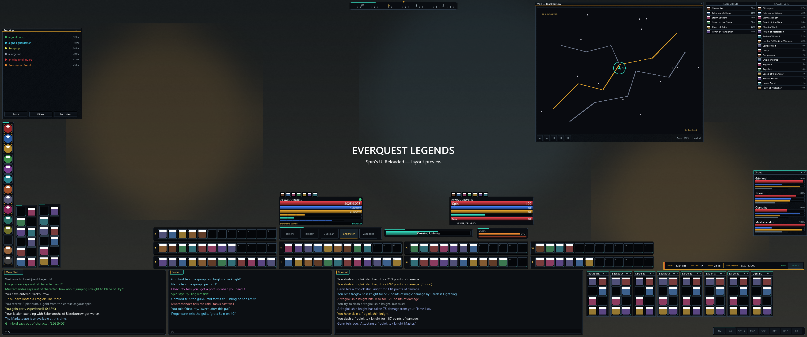
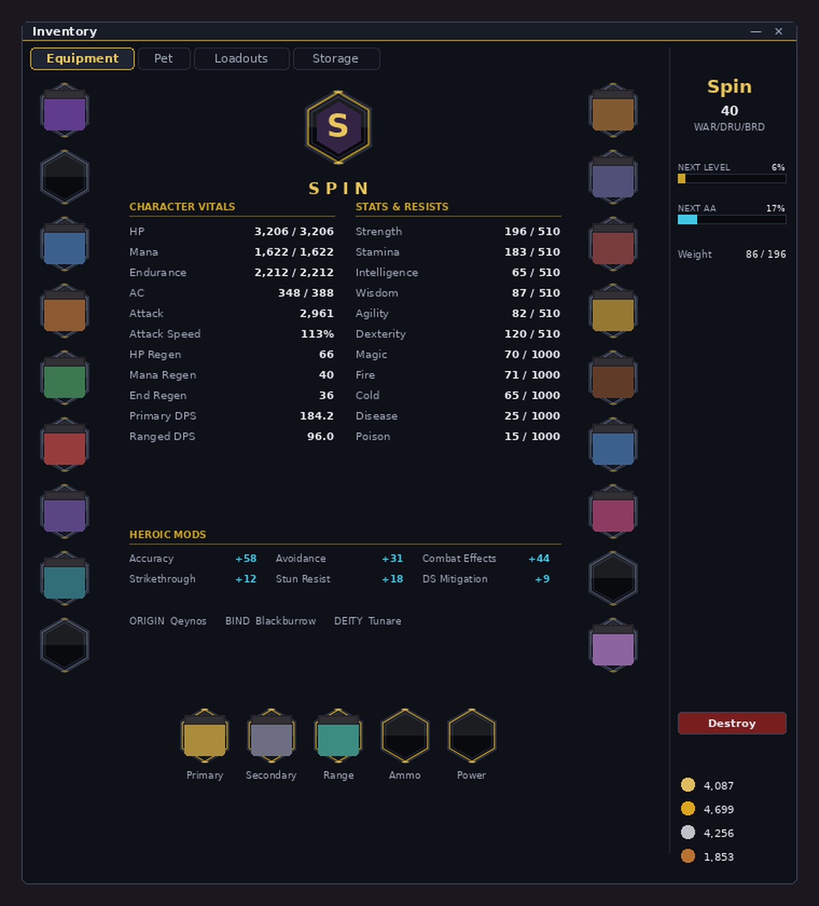

# Spin's UI Reloaded

**A complete "Obsidian & Ember" interface overhaul for EverQuest Legends, purpose-built for 3440x1440 ultrawide** — plus **Spin's Loremaster**, a zero-dependency log-reading session tracker that docks straight into the layout.



*The preview above is rendered from the real skin textures at the real layout coordinates by `tools/render_preview.py`.*

---

## Contents

1. [What's inside](#whats-inside)
2. [The theme — Obsidian & Ember](#the-theme--obsidian--ember)
3. [The 3440x1440 layout](#the-3440x1440-layout)
4. [Installation](#installation)
5. [Chat: three windows, three presets](#chat-three-windows-three-presets)
6. [The map](#the-map)
7. [Bags, bank bags and the dock](#bags-bank-bags-and-the-dock)
8. [Spin's Loremaster (log parser & DPS tracker)](#spins-loremaster)
9. [Customizing & regenerating](#customizing--regenerating)
10. [Troubleshooting](#troubleshooting)
11. [Repository map](#repository-map)

---

## What's inside

| Piece | What it is |
|---|---|
| `spinui_reloaded/` | The full UI skin (985 files) — a themed overhaul of the modern default skin. Every window inherits the new look. |
| `UI_Spin_qeynos_LO1.ini` | Drop-in personal layout for **Spin @ qeynos**, pixel-planned for 3440x1440 (combat-focus preset). |
| `layouts/combat-focus/` `layouts/social-focus/` `layouts/hybrid/` | The same layout with three different chat-row arrangements — pick your style. |
| `layouts/original/` | Your pre-overhaul UI file, untouched, in case you ever want to roll back. |
| `loremaster/` | **Spin's Loremaster** — the EQBuddy-inspired log parser / DPS tracker overlay. |
| `tools/` | The generators that built everything (textures, layout, preview). Rerunnable and hackable. |
| `docs/previews/` | Rendered previews of the skin and the full-screen layout. |

Design inspiration: ELVUI / TOXIC UI's bottom-anchored, flat-glass composition — translated into EverQuest's SIDL skin system.

---

## The theme — Obsidian & Ember

Every shared chrome texture was redrawn programmatically (see `tools/generate_spinui_textures.py`), so **all** windows — inventory, merchant, tradeskill, guild, raid, overseer, everything — pick up the theme automatically:

| Role | Color | Where you see it |
|---|---|---|
| Obsidian glass | `#0B0D12 → #181C27` | window backgrounds, buttons, slots |
| Steel line | `#3A4152` | 1px window & button outlines |
| **Ember gold** | `#C9A227` / `#E8C55C` | titlebar base-line, pressed buttons, XP, headers |
| **Arcane cyan** | `#41C7E4` | hover states, selections, casting, AA |
| HP / Mana / Endurance | `#D93A3F` / `#3E7BFA` / `#D9A13A` | every vitals gauge, group rows, target HP |
| Text | `#E8EAF0` primary / `#9AA3B5` dim | labels everywhere |

Gauges use a neutral silver "glass" strip that the client tints per-gauge — so HP reads deep red, mana electric blue, endurance amber, XP gold, AA cyan, casting cyan, all with the same glassy sheen. Spell **gem icons are untouched** (as requested) — only the gem *sockets* got the obsidian + gold-tick treatment.

Window XML polish applied on top (133+ verified value-level edits): vivid gauge tints in Player/Target/Group/Pet/ExtTarget/Casting/Breath/Aggro windows, readable label colors in the buff & song windows, map coordinate readouts flipped from black to light (they'd be invisible on the dark map), and target-name text bumped to a larger font.

---

## The 3440x1440 layout

Everything important lives in a band across the bottom — eyes stay near your character. The vertical center of the screen is kept clear.

```
┌────────────────────────────────────────────────────────────────────────────────┐
│ Tracking (toggle)        Compass                     Map (toggle)  Songs  Buffs │
│                                                      ┌─────────┐  ┌────┐ ┌────┐│
│  ┌────┐                                              │  glass  │  │song│ │buff││
│  │ 14 │                                              └─────────┘  └────┘ │    ││
│  │gem │                — clear view of the world —                       └────┘│
│  │dock│                                                                  Group │
│  │    │                ┌────────┐              ┌────────┐               ┌────┐ │
│  └────┘                │ Player │ [cast][aggro]│ Target │               │    │ │
│     [vert 1][vert 11]  └────────┘  [stances]   └────────┘               └────┘ │
│          [bars 8/7/6]  [bars 4+5 / 2+3]  [bars 9/10]                           │
│ ┌───────────┬───────────┬───────────────┬──────────────────────────────┐       │
│ │ Main Chat │  Social   │    Combat     │  LOREMASTER dock / bag row   │ [menu]│
│ └───────────┴───────────┴───────────────┴──────────────────────────────┘       │
└────────────────────────────────────────────────────────────────────────────────┘
```

Zone by zone:

* **Chat row (y 1152-1432):** Main Chat, Social, and Combat side by side across the bottom — every message stream visible at once, nothing stacked or tabbed away.
* **Center combat cluster:** Player plate (left) and Target plate (right) sit just above the hotbars; between and below them the stance bar (Legends stances), centered cast bar, and aggro meter. Two main hotbar rows sit directly under the plates, with utility banks flanking left and right — nine horizontal banks + two vertical banks + the 14-gem spell dock on the left edge, all preserved from your setup, just organized.
* **Right column:** Spell Effects and Song Effects pinned top-right (both now **visible by default** — you're a WAR/DRU/BRD, you want your songs), using the clean **LEFT-anchored, no-numbering list style** (icons beside names, no floating number rail). Right-click either window to switch styles any time. Group window sits on the right edge below them. Extended Target keeps your "hidden" preference but has a tidy parking spot for when you enable it.
* **Top-right glass:** the Map (toggleable) — see [The map](#the-map).
* **Bottom-right dock (x 2492-3432):** deliberately left empty by the HUD — this is where **Loremaster** docks and where your **inventory bags tile** when opened.
* **Openable windows** (inventory, bank, loot, merchant…) spawn center-left/center so they never cover the chat row or the combat cluster.

The layout is validated by script: every window fully on-screen at 3440x1440, zero overlaps among default-visible HUD windows, in all three presets.

### Quality-of-life defaults changed vs. your old file

| Window | Old | New | Why |
|---|---|---|---|
| Buff window | hidden | **shown** (top-right) | buff awareness; `ALT+B` to toggle |
| Song window | hidden | **shown** (under buffs) | bard songs at a glance |
| Casting bar | hidden | **shown** (centered) | see your own cast progress |
| Chat font | size 3 | **size 5** | 3440x1440 readability (right-click chat → Font to change) |
| Buff/Song style | RIGHT + number rail | **LEFT list, no numbering** | icons beside names — clean |
| Player/Target buff strip | opaque texture band | **transparent** | icons float on the window |
| HUD label fonts | 2-4 | **+1 across the board** | mana/end numbers, level/class, stance, group names |
| Chat/glass windows | opaque | soft-fade when inactive | sleekness; fades back up on hover |

Everything else (pet window hidden, extended target hidden, etc.) respects your original choices — but every window has a designed position waiting for the day you enable it.

---

## Installation

> **Golden rule: edit/copy INI files while the game is fully closed.** The client rewrites UI INIs on logout — changes made while logged in are lost.

1. **Install the skin**
   Copy the `spinui_reloaded` folder into your EverQuest Legends `uifiles` directory:
   ```
   C:\Users\Public\Daybreak Game Company\Installed Games\EverQuest Legends\uifiles\spinui_reloaded\
   ```

2. **Install the layout** (for Spin @ qeynos)
   Copy `UI_Spin_qeynos_LO1.ini` into the EverQuest Legends **root** folder (next to `eqgame.exe`), replacing the existing file. Want a different chat arrangement? Take the file from `layouts/social-focus/` or `layouts/hybrid/` instead — same filename, same destination.

3. **Other characters**
   Copy the same file and rename it: `UI_<Name>_<server>_LO1.ini` must match your character's existing UI file name in the EQ root folder.

4. **Log in.** The INI's `UISkin=spinui_reloaded` loads the skin automatically. If you ever need it manually: `/loadskin spinui_reloaded 1` (the `1` keeps window positions).

5. *(Optional but recommended)* turn on logging for Loremaster: `/log on` in game, then see [Spin's Loremaster](#spins-loremaster).

**Rollback:** copy `layouts/original/UI_Spin_qeynos_LO1.ini` back into the EQ root, and select the stock skin with `/loadskin default_modern 1`.

---

## Chat: three windows, three presets

Three real windows (not tabs), pre-routed:

| Window | Gets | Notes |
|---|---|---|
| **Main Chat** | everything not routed elsewhere — OOC, shout, auction, system, loot, XP, faction… | typed text defaults to /say |
| **Social** | **Say, Tell, Group, Guild** | the four filter indices that have been stable in the EQ client since 2002 — guaranteed-correct routing |
| **Combat** | your hits, others' hits, spells, crits — the full combat routing you already had | unchanged from your proven setup |

**One two-click step for Raid chat:** the raid-say filter index isn't documented reliably across client builds, so rather than risk mis-routing we left it default. In game: right-click the **Social** window's title area → **Filters** → **Raid Say** → **Social** (and repeat for *Raid Chat* if listed). The client saves it to your INI permanently.

The presets differ only in the chat row:

| Preset | Main | Social | Combat | For |
|---|---|---|---|---|
| `combat-focus` *(default)* | 700px | 700px | **1060px** | parsing every swing on a wide pane |
| `social-focus` | 800px | **1000px** | 660px | raid/guild chatter first |
| `hybrid` | 900px | 1000px | **560px, half-height** | combat as a compact self-ticker |

*Hybrid + true self-only combat:* the small window already keeps combat out of your way; to fully silence **other people's** melee spam, use Options (`ALT+O`) → **Chat** filters → set *Others' Melee* categories to **Off** — filter visibility is a game-side setting that routing can't override, so this stays a 30-second manual step.

---

## The map

Tuned for **running with the map open**:

* Top-right glass panel (640x520) — clear of the buff/song columns, the group window, and the whole combat cluster; your character and the world stay unobstructed.
* **Translucent by design** (`Alpha 225`) and **fades to 150** when it isn't the active window — terrain reads through it while you navigate, and it solidifies the moment you mouse in.
* Coordinate/zone readouts recolored from black to light text so they're readable on the dark canvas.
* Toggle it with your usual map key; the INI keeps its position and size permanently.
* Pair with in-game Map Options → *Auto Center on Player* (and *Rotate* if you like) for the get-lost-proof experience; `/mapfilter` tunes POI density.

---

## The equipment screen



Inspired by WoW's **Narcissus**, the Equipment tab was rebuilt as a cinematic composition (window grows to 720x800):

* **Two floating slot rails** — armor down the left, jewelry down the right — each slot seated on a custom-drawn **obsidian hex plate** with a steel edge and ember tick-marks (`spin_deco.tga`).
* **Weapons row** on gold-edged hexes across the bottom center: Primary · Secondary · Range · Ammo · Power.
* **Class crest centerpiece** — the class emblem (still a functional *drop-to-auto-equip* target) floats top-center on a gold hex.
* **Stat columns flow between the rails**: Character Vitals and Stats & Resists as clean ruled columns, heroic mods beneath.
* Every slot keeps its ScreenID and EQType — pure geometry + additive art, so drag/drop, tooltips and auto-equip behave exactly like stock.
* Regenerate or tweak the composition via `tools/restyle_inventory.py` (rail order and pitch are data at the top of the file).

---

## Bags, bank bags and the dock

* **Inventory bags** (`BagInv1-8`) are pre-positioned to tile in **one clean row** in the bottom-right dock (under the Loremaster panel) — open all bags and they line up 8-across, no cascade mess, no overlap with any HUD element.
* **Bank bags** (`BagBank1-16`) tile in a tidy **8x2 grid** beside the bank window in screen center — all sixteen visible at once while banking, clear of the player/target plates.
* The bank and big-bank windows themselves open center-left; the item **Find** feature and slot chrome all inherit the theme.
* Moved a bag? The client remembers your new spot per-slot from then on.

---

## Spin's Loremaster

*The log parser — DPS, XP, pets, songs, loot, and time-to-level in one obsidian panel.*

Built after a code review of **EQBuddy** (C#/WPF) and reimplemented as a single-file, standard-library-only Python app so it's hackable and install-free. Same proven engine constants; more stats.

### Run it — the easy way (no install)

Grab **`Loremaster.exe`** and double-click it. Done — no Python, no setup.

* The EXE is built automatically by GitHub Actions (`.github/workflows/build-loremaster.yml`) on every change: download it from the repo's **Actions → Build Loremaster.exe → Loremaster-windows** artifact, or from the **Releases** page once a release is tagged.
* Windows SmartScreen may warn on first run (unsigned indie EXE) — "More info → Run anyway".

### Run it — from source

```bat
:: needs Python 3.10+ from python.org (tkinter included)
cd loremaster
Loremaster.bat            :: or:  python loremaster.py
python loremaster.py --demo      :: instant synthetic fight, no EQ needed
python loremaster.py --selftest  :: parser + math test suite
```

In game, enable logging once: **`/log on`**. Loremaster auto-finds the newest `eqlog_<Char>_<server>.txt` in the standard Legends `Logs` folder (override in `loremaster_config.json` or `--log-dir`).

### What it tracks

* **Combat-aware DPS** — fights open on *your* (or your pet's) first action, close after **10s** of silence; group members' activity extends a fight only within a **20s** grace window of your own last action, so tagging one mob never inherits the whole camp's timeline. Live **fight DPS**, **session DPS** (downtime excluded), **best fight**, and a rolling fight history with per-fight damage, duration, and DPS.
* **Damage breakdown** — melee vs. each spell vs. DoTs vs. **pet damage** (pet names learned automatically from `'Attacking … Master.'` / `'My leader is …'` lines), with percentage bars.
* **Pet count** — how many distinct pets acted in the last 60s (swarm-friendly).
* **Bard songs** — songs twisted and songs/min.
* **XP** — gains counted; when Legends logs percentages, you get **XP %/hr** and **estimated time to level** = remaining % ÷ %/hr (survives restarts via per-character state). Level-ups reset the bar.
* **Everything else** — kills (per-creature), deaths, crits, HPS & overheal, damage taken, enemy misses, loot list, coin → **plat/hr**, faction hits, skill-ups, AA points, fizzles/resists/interrupts, zone.
* **Per-character auto-tracking** — swap toons and it follows the newest log, saving each character's state to `loremaster_data/<Char>.json`. Sessions auto-reset after **60 min** idle.

### The overlay

* Always-on-top, borderless obsidian panel with the ember-gold frame — **drag anywhere** to move; position remembered. It defaults to the layout's reserved shelf at **2792,676** (right side, above the bag dock, clear of the map, group window and hotbars); mini mode defaults to a slim strip just above the bags.
* **Mini mode** (— button): a slim strip showing only your **starred** stats. **Right-click any stat** to star/unstar it (★). A ⚔ live-DPS chip appears while you're in combat.
* ↺ resets the session; config in `loremaster_config.json` (opacity, log dir, starred stats).

---

## Customizing & regenerating

Everything was *generated* — change a constant, rerun, done. From the repo root:

```bash
pip install pillow                                # only needed for the two art scripts
python3 tools/generate_spinui_textures.py         # repaint the theme textures
python3 tools/generate_spinui_layout.py           # rebuild all layout INIs (validates!)
python3 tools/render_preview.py                   # re-render the full-screen preview
```

* **Recolor the whole UI:** edit the palette block at the top of `generate_spinui_textures.py` (and the matching hexes in `loremaster.py` / `render_preview.py`).
* **Move a window:** edit its pixel coordinates in `PLACEMENTS` in `generate_spinui_layout.py` — the script converts to the client's percentage format and re-validates the whole screen for overlaps/off-screen.
* **New chat preset:** add an entry to `CHAT_PRESETS` — it lands in `layouts/<name>/` automatically.
* The generators always start from the **pristine** stock files in git history, so reruns never compound.

---

## Troubleshooting

| Symptom | Fix |
|---|---|
| Layout didn't apply | The game was running when you copied the INI — close EQ fully, copy again, relaunch. |
| Skin didn't load | Folder must be exactly `uifiles\spinui_reloaded\`; then `/loadskin spinui_reloaded 1`. |
| A window is somewhere weird | `/loadskin spinui_reloaded` **without** the `1` re-applies the skin's default 1440p layout (`default1440.ini`). |
| Raid chat in Main instead of Social | That's the documented two-click step — see [Chat](#chat-three-windows-three-presets). |
| Chat font too big/small | Right-click the chat window → Font. |
| Loremaster shows "awaits your log" | `/log on` in game; check `log_dir` in `loremaster_config.json`. |
| Time-to-level shows — | Needs XP % in log lines (Legends logs them) and a few minutes of kills to establish a rate. |
| Playing at 2560x1440 | Positions are percentage-based and scale horizontally; the design target is 3440 — expect tighter gaps, no overlaps in the chat row/HUD band. |
| Want everything locked | Right-click a window → Lock, once you're happy. |

---

## Repository map

```
spinips/
├── spinui_reloaded/            the skin (drop into uifiles/)
│   ├── EQUI_*.xml              window definitions (themed)
│   ├── window_*.tga, wnd_*.tga redrawn chrome textures
│   └── default1440.ini         the skin's default 1440p layout
├── UI_Spin_qeynos_LO1.ini      your personal layout (combat-focus)
├── layouts/
│   ├── combat-focus/ social-focus/ hybrid/   preset personal layouts
│   └── original/               your pre-overhaul file (rollback)
├── loremaster/
│   ├── loremaster.py           the tracker (stdlib-only)
│   └── Loremaster.bat          Windows launcher (from source)
├── .github/workflows/
│   └── build-loremaster.yml    CI: builds one-click Loremaster.exe
├── tools/
│   ├── generate_spinui_textures.py   theme painter
│   ├── generate_spinui_layout.py     layout builder + validator
│   └── render_preview.py             full-screen preview renderer
└── docs/previews/              rendered previews
```

---

*Spin's UI Reloaded — forged in obsidian, edged in ember. See you in Norrath.*
