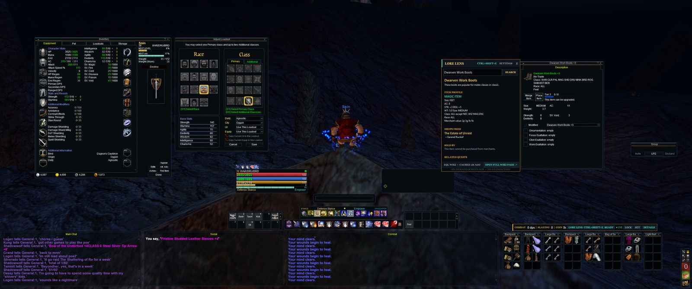
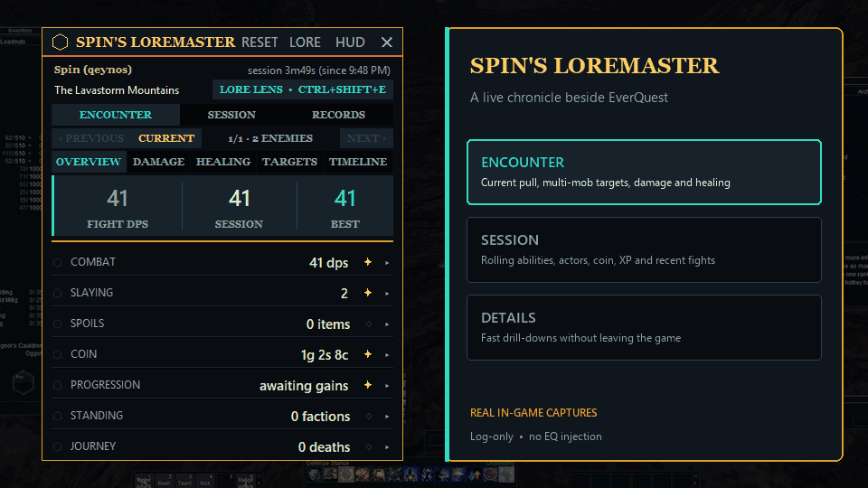
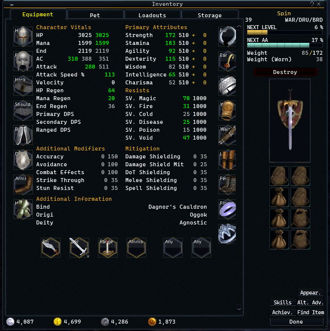
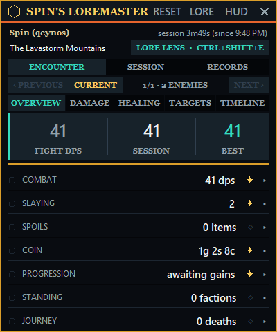
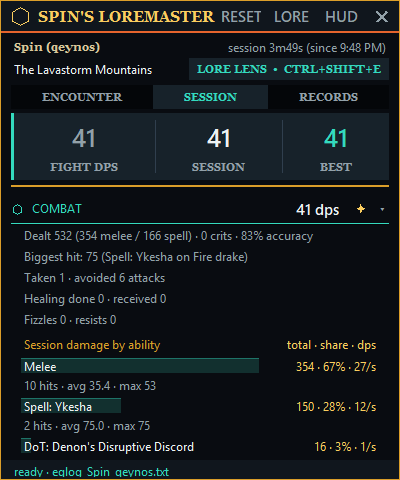
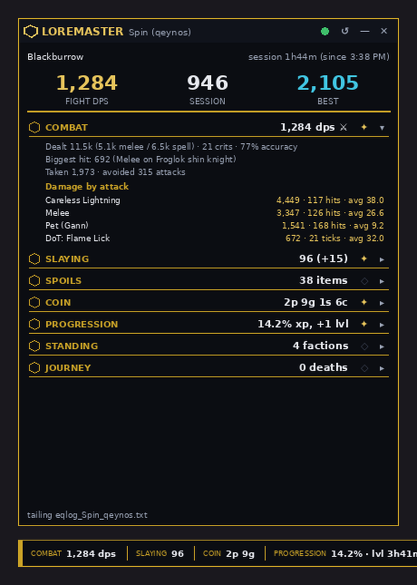

# Spin's UI Reloaded

**A complete Obsidian, Venom & Ember interface for EverQuest Legends.** SpinUI rebuilds the aging EQ presentation around a crisp combat dock, cinematic equipment screen, readable effects and spell controls, safe 2560×1440 defaults, optional 3440×1440 layouts, **SpinUI Studio** for offline layout and color editing, and **Spin's Loremaster**, a live Encounter Lab and EQL Wiki companion that never injects into the game.

[**Download the latest release**](https://github.com/itsspin/spinips/releases/latest) · Windows · EverQuest Legends · Log-only companion · Standard-library runtime

## Real in-game showcase



*A real 3440×1440 in-game capture supplied by the author*

### Loremaster in action



*Animated feature tour assembled from real Loremaster captures. The alert rail uses the application's actual notification styling and values from the captured session; it is not presented as continuous gameplay footage.*

| Cinematic equipment, live in game | Encounter Lab, live in game |
|:---:|:---:|
|  |  |

| Loremaster session analysis | Lore Lens feature reference |
|:---:|:---:|
|  |  |

*The Cloak of Flames panel is the one clearly labeled rendered feature reference in this gallery. It mirrors Loremaster's production visual system and uses a deterministic example verified against the structured [EQL Wiki Cloak of Flames page](https://eqlwiki.com/Cloak_of_Flames); every other gallery image is derived from the author's real in-game captures.*

---

## Contents

1. [What's inside](#whats-inside)
2. [The theme: Obsidian, Venom & Ember](#the-theme-obsidian-venom--ember)
3. [The 3440x1440 layout](#the-3440x1440-layout)
4. [SpinUI Studio: offline editor](#spinui-studio-offline-layout-and-theme-editor)
5. [Installation](#installation)
6. [Chat: three windows, three presets](#chat-three-windows-three-presets)
7. [The map](#the-map)
8. [Bags, bank bags and the dock](#bags-bank-bags-and-the-dock)
9. [Spin's Loremaster (log parser & DPS tracker)](#spins-loremaster)
10. [Customizing & regenerating](#customizing--regenerating)
11. [Troubleshooting](#troubleshooting)
12. [Repository map](#repository-map)

---

## What's inside

| Piece | What it is |
|---|---|
| `spinui_reloaded/` | The full UI skin - a themed overhaul of the modern default skin. Every window inherits the new look; the shipped 1440p default is safe at 2560x1440. |
| `UI_Spin_qeynos_LO1.ini` | Complete example layout for **Spin @ qeynos**, pixel-planned for 3440x1440 (Combat Focus). Existing characters should use the installer's safe merge. |
| `layouts/combat-focus/` `layouts/social-focus/` `layouts/hybrid/` | The same layout with three different chat-row arrangements - pick your style. These three are the only layout folders included in release packages; `layouts/original/` and `layouts/spin-live/` are internal generator bases kept in the repository. |
| `layouts/original/` | The author's pre-overhaul Spin profile, retained as project history, not a substitute for another player's backup. |
| `SpinUIStudio.exe` | The offline 3440×1440 layout, visibility, and accent-color editor included in both Windows release packages. |
| `loremaster/` | **Spin's Loremaster** - the real-time Encounter Lab, session tracker, DPS overlay, and Lore Lens item-wiki companion. |
| `tools/` | The generators that built everything (textures, layout, preview). Rerunnable and hackable. |
| `docs/screenshots/` | Privacy-reviewed, real in-game SpinUI and Loremaster captures used in this README. |
| `docs/previews/` | Clearly labeled rendered references for features that are difficult to capture safely. |

Design inspiration, translated into EverQuest's SIDL skin system: **ELVUI / TOXIC UI** (bottom-anchored flat-glass HUD), **Narcissus** (the cinematic equipment screen), **Details!** (Loremaster's meters), **WeakAuras / DBM** (Loremaster's alert banners), **SexyMap** (the glass map).

---

## The theme: Obsidian, Venom & Ember

Every shared chrome texture was redrawn programmatically (see `tools/generate_spinui_textures.py`), so **all** windows - inventory, merchant, tradeskill, guild, raid, overseer, everything - pick up the theme automatically:

| Role | Color | Where you see it |
|---|---|---|
| Matte obsidian | `#05070A → #17222A` | window backgrounds, control layers, slots |
| Gunmetal line | `#303F4E` | crisp window, button, and content-well outlines |
| **Ember gold** | `#DB9E2A` / `#FACD5F` | committed states, XP, records, heraldic identity |
| **Venom arcane** | `#34DABE` | signal rails, hover/selection, casting, AA, active tabs |
| HP / Mana / Endurance | `#DE3E48` / `#427EF4` / `#DB9E2A` | every vitals gauge, group row, target HP |
| Text | `#EEF2F3` primary / `#92A1A9` dim | high-contrast labels and secondary data |

Gauges use a compact high-contrast gradient that the client tints per gauge, so HP reads deep red, mana electric blue, endurance amber, XP gold, and casting/AA venom-teal without losing a consistent material language. Spell art is now centered at a crisp **36×36** inside each native 40×40 socket, so the icons fill the rail cleanly without stretching or changing their function.

Window XML polish applied on top (133+ verified value-level edits): vivid gauge tints in Player/Target/Group/Pet/ExtTarget/Casting/Breath/Aggro windows, readable label colors in the buff & song windows, map coordinate readouts flipped from black to light (they'd be invisible on the dark map), and target-name text bumped to a larger font.

---

## The 3440x1440 layout

Everything important lives in a band across the bottom - eyes stay near your character. The vertical center of the screen is kept clear.

This is the optional character-layout preset shown in the full HUD screenshot. It is not forced by the installer. The skin's `default1440.ini` is separately generated and overlap-validated for standard **2560x1440**, so community members on a normal 16:9 1440p display receive an intentional layout instead of ultrawide coordinates squeezed onto their screen. **4K is a first-class target too:** `default4k.ini` is a separately generated, overlap-validated **3840x2160** composition - symmetrical three-pane chat row, the combat cluster perfectly centered on the screen midline, buffs/songs flush to the real right edge, and chat set to the client's largest font so text stays comfortably readable at 4K pixel density. The stock 1080p default remains included as well, and the installer detects your resolution from `eqclient.ini` (read-only) and tells you which default will apply.

<details>
<summary><strong>Technical 3440×1440 layout map</strong></summary>

```text
┌────────────────────────────────────────────────────────────────────────────────┐
│ Tracking (toggle)        Compass                     Map (toggle)  Songs  Buffs │
│                                                      ┌─────────┐  ┌────┐ ┌────┐│
│  ┌────┐                                              │  glass  │  │song│ │buff││
│  │ 14 │                                              └─────────┘  └────┘ │    ││
│  │gem │                - clear view of the world -                       └────┘│
│  │dock│                                                                  Group │
│  │    │                ┌────────┐              ┌────────┐               ┌────┐ │
│  └────┘                │ Player │ [cast][aggro]│ Target │               │    │ │
│     [vert 1][vert 11]  └────────┘  [stances]   └────────┘               └────┘ │
│          [bars 8/7/6]  [bars 4+5 / 2+3]  [bars 9/10]                           │
│ ┌───────────┬───────────┬───────────────┬──────────────────────────────┐       │
│ │ Main Chat │  Social   │    Combat     │  LOREMASTER dock / bag row   │ [menu]│
│ └───────────┴───────────┴───────────────┴──────────────────────────────┘       │
└────────────────────────────────────────────────────────────────────────────────┘
```

</details>

Zone by zone:

* **Chat row (y 1152-1432):** Main Chat, Social, and Combat side by side across the bottom - every message stream visible at once, nothing stacked or tabbed away.
* **Center combat cluster:** Player plate (left) and Target plate (right) sit just above the hotbars; their stance/empower rails use the full plate width so long Legends labels remain readable without colliding. The low-profile Pet command center has a measured parking spot immediately left of Player, with an exact 8px side gap whenever it is enabled. Between and below the main plates sit the **twin-wing stance bar** - a `STANCE` wing in ember gold on the left and an `INVOCATION` wing in venom on the right, each carrying its active name, split by a small ember gem (the ability buttons remain one client-managed row, flowing from the gold wing toward the venom wing) - plus the centered cast bar and aggro meter. Two main hotbar rows sit directly under the plates, with utility banks flanking left and right - nine horizontal banks + two vertical banks + the 14-gem spell dock on the left edge, all preserved from your setup, just organized.
* **Right column:** Spell Effects and Song Effects pin top-right in slim transparent rails with 20px icons and contiguous authored rows, no oversized black backplates or artificial gutters. They use the clean **LEFT-anchored, no-numbering list style** (icons beside names, no floating number rail). Right-click either window to switch styles any time. Group sits below them; Extended Target keeps a tidy parking spot for whenever you enable it. A sparse engine-assigned effect slot can still reserve its own row, because SpinUI does not rewrite live buff-slot identity.
* **Top-right glass:** the Map (toggleable) - see [The map](#the-map).
* **Bottom-right dock (x 2492-3432):** deliberately left empty by the HUD - this is where **Loremaster** docks and where your **inventory bags tile** when opened.
* **Openable windows** (inventory, bank, loot, merchant…) spawn center-left/center so they never cover the chat row or the combat cluster.

The layout generator validates three distinct targets: every window fully on-screen with zero default-visible overlaps for the optional 3440x1440 presets, and the same guarantees for the standard 2560x1440 and 3840x2160 (4K) skin defaults.

### Quality-of-life defaults changed vs. your old file

| Window | Old | New | Why |
|---|---|---|---|
| Buff window | hidden | **shown** (top-right) | buff awareness; `ALT+B` to toggle |
| Song window | hidden | **shown** (under buffs) | bard songs at a glance |
| Casting bar | hidden | **shown** (centered) | see your own cast progress |
| Chat font | size 3 | **size 5** (size 6 in the 4K default) | readability at 1440p and 4K pixel density (right-click chat → Font to change) |
| Pet command window | cramped 311x190, 57px commands | **513x181 fixed side rail, direct 78px four-column commands** | no overhead dark slab; all commands and 42 effect positions remain reachable |
| XP vs AA bars | both overlaid pure blue | **XP ember gold, AA venom** - fills *and* sub-tick overlays, in the player plate, inventory, and AA window | tell the two progression bars apart at a glance |
| Buff/Song style | RIGHT + number rail | **slim LEFT list, no numbering** | larger readable icons, transparent rows, no heavy black slab |
| Player/Target rails | opaque bands and tight text | **transparent, full-width** | effects float cleanly; stance/empower labels fit |
| HUD label fonts | 2-4 | **+1 across the board** | mana/end numbers, level/class, stance, group names |
| Chat/glass windows | opaque | soft-fade when inactive | sleekness; fades back up on hover |

Everything else (pet window hidden, extended target hidden, etc.) respects your original choices - but every window has a designed position waiting for the day you enable it.

---

## SpinUI Studio: offline layout and theme editor

`SpinUIStudio.exe` lets you compose and build SpinUI while EverQuest or its
servers are unavailable. Keep the executable beside the release's
`spinui_reloaded`, `layouts`, and `UI_Spin_qeynos_LO1.ini` content, then open
it directly; no Python installation is required.

The Studio canvas is a full 3440×1440 composition driven by the same window
geometry, real SpinUI textures, layout generator, and character-INI fields as
the shipped game UI. On startup Studio detects common EverQuest installs and
offers to read the newest `UI_<Character>_<server>_LO#.ini`, so the canvas
begins at the character's current in-game positions, hotbar/spell orientation,
scale, and sizes. EverQuest's left, right, top, bottom, and half-screen
`center` anchors are converted to exact pixels and tested through a lossless
import/export/import round trip.

Drag a previewed window to reposition it, drag the gold lower-right handle to
resize supported windows, use the inspector for exact coordinates, or nudge
with the arrow keys (Shift = 10px). Double-click a row to preview a normally
hidden window such as Inventory, bags, or Pet without changing whether it
opens at login. **Preview on canvas** and **In-game start state** are separate
controls; the latter can preserve the imported INI, force show, or force hide.
Combat Focus, Social Focus, and Hybrid remain available as deliberate resets.

Three color controls independently tune the **Venom**, **Gold**, and **Ember**
accents. Studio derives their complete highlight/shadow ramps, applies them to
the preview, and builds the actual XML and TGA assets that EverQuest loads.
Projects save as small JSON files for continued editing. **SAVE PREVIEW**
writes a full-resolution PNG, **EXPORT INI** writes the game-ready character
layout, and **BUILD FINAL UI** creates a new, self-contained bundle containing
the custom skin, INI, project, and installation notes. Studio refuses to
replace an existing build folder. If a user explicitly exports over an INI in
the live game folder, Studio first confirms EverQuest is closed, creates a
timestamped byte-exact backup, and replaces the file atomically.

### Accuracy contract

| Preview element | Offline fidelity |
|---|---|
| Window position, size, visibility, and 3440×1440 bounds | Authoritative: all EQ anchor modes resolve to the same pixels, and exported values round-trip with zero geometry differences across 63 managed windows. |
| Window chrome and custom accents | Authoritative assets: built from the real SpinUI TGA/XML sources loaded by the game. |
| Chat routing and preserved character settings | Imported from the selected INI; exported through the same audited layout transformation used by the release. |
| Names, chat text, buffs, gauges, items, and other live state | Clearly labeled deterministic sample data; only `eqgame.exe` can supply runtime values. |
| Font rasterization, client-only scaling, and live content flow | Close visual reference, not a claim of client emulation. EverQuest remains the final renderer. |

This is the strongest reliable offline workflow: the authored geometry and
assets are the game inputs, while client-owned state is simulated rather than
guessed. When the servers return, close EverQuest before installing the build,
launch once, and use `/loadskin <custom_skin_name> 1` for the final client
smoke test.

From a source checkout, install Pillow and run:

```text
python tools/spinui_studio.py
```

The deterministic non-GUI checks are
`python tools/spinui_studio.py --selftest` and
`python tools/spinui_studio.py --render-preview spinui-preview.png`. Use
`--ini C:\path\to\UI_Character_server_LO1.ini` to launch or render directly
from a current character layout. If a GUI callback ever fails, Studio remains
open and records the traceback in
`%LOCALAPPDATA%\SpinUIStudio\spinui-studio.log`.

---

## Installation

> **Golden rule: edit/copy INI files while the game is fully closed.** The client rewrites UI INIs on logout - changes made while logged in are lost.

### Automatic Windows installer

1. Download `SpinUI-Installer.zip` from the newest entry on the GitHub **Releases** page. Maintainers can also run **Actions → Build SpinUI Windows package**: leave **Publish these builds on the GitHub Releases page** enabled and choose the release tag to create or refresh.
2. Extract the whole ZIP, close EverQuest, then run `SpinUIInstaller.exe`. It detects common Daybreak and Steam installations; **Browse** can locate any custom folder containing `eqgame.exe`. Re-running it is a supported update path: the skin is cleanly refreshed so obsolete files cannot linger, while Loremaster's saved config and records remain intact.
3. The visual layout step defaults to **KEEP MY CURRENT LAYOUT**. Combat Focus, Social Focus, and Hybrid are opt-in 3440×1440 cards with miniature layout diagrams. Pick a detected character INI, or choose **Character not listed / create target**, enter the character name with exact capitalization, and select Erudin (European), Freeport, Halas, Neriak, Oggok, Paineel (European), Qeynos, or Rivervale. The wizard previews the exact filename (for example `UI_Spin_qeynos_LO1.ini`) before continuing.
4. Applying a preset to an existing character is a surgical merge, not a file replacement - and it now delivers the *complete* layout. `UISkin`, the audited window anchors/positions/sizes, each window's visibility and fade settings, and the three-window chat routing (`ChatManager`) are applied; locks, map preferences, hotbuttons/macros, spell data, loadouts, client-added sections, and unknown future settings remain untouched. A timestamped byte-exact backup is created only when the merge actually changes the file; reapplying the same preset is a no-op. A genuinely new filename can be seeded only after the review page clearly identifies it as new.
5. **Start Loremaster with Windows** and **Create a Loremaster desktop shortcut** are enabled by default. Startup remains hidden and virtually idle until `eqgame.exe` appears; the desktop shortcut opens the HUD directly.
6. In game, type `/log on` once and use `/loadskin spinui_reloaded 1` if the skin is not already selected.

### Manual installation

Download `SpinUI-Manual` from the same workflow run or `SpinUI-Manual.zip` from a release. It contains the UI, SpinUI Studio, Loremaster, layouts, default INI, and a standalone `INSTALL.md`; there is no installer executable in this package.

1. **Install the skin**
   Copy the `spinui_reloaded` folder into your EverQuest Legends `uifiles` directory:
   ```
   C:\Users\Public\Daybreak Game Company\Installed Games\EverQuest Legends\uifiles\spinui_reloaded\
   ```

2. **Optional: install a full ultrawide layout manually**
   The preset INIs are complete 3440×1440 UI profiles. Copying one over an existing `UI_<Character>_<server>_LO1.ini` replaces that file's window preferences and chat configuration. Use the guided installer when you want the safe audited merge described above (layout, visibility, and chat routing - nothing else). If you intentionally want a complete manual replacement, close EQ, make a byte-for-byte backup first, then choose the top-level Combat Focus file or the matching file under `layouts/social-focus/` or `layouts/hybrid/`.

3. **Name the optional layout for the correct character**
   The filename is case-sensitive for the character portion and uses the canonical lowercase server token: `UI_<ExactCharacterName>_<server>_LO1.ini`. For example, Spin on Qeynos is `UI_Spin_qeynos_LO1.ini`. Copy it into the EverQuest Legends **root** beside `eqgame.exe`. Never rename or replace the separate `<Character>_<server>_LO1.ini` or `eqclient.ini` files.

4. **Log in.** The INI's `UISkin=spinui_reloaded` loads the skin automatically. If you ever need it manually: `/loadskin spinui_reloaded 1` (the `1` keeps window positions).

5. *(Optional but recommended)* turn on logging for Loremaster: `/log on` in game, then see [Spin's Loremaster](#spins-loremaster).

**Rollback:** restore the exact character UI backup you made (the installer names its backups `.spinui-backup-YYYYMMDD-HHMMSS`), then select the stock skin with `/loadskin default_modern 1` if desired. `layouts/original/` remains Spin's historical profile, not a universal backup for another player.

---

## Chat: three windows, three presets

Three real windows (not tabs), pre-routed:

| Window | Gets | Notes |
|---|---|---|
| **Main Chat** | everything not routed elsewhere - OOC, shout, auction, system, loot, XP, faction… | typed text defaults to /say |
| **Social** | **Say, Tell, Group, Guild** | the four filter indices that have been stable in the EQ client since 2002 - guaranteed-correct routing |
| **Combat** | your hits, others' hits, spells, crits - the full combat routing you already had | unchanged from your proven setup |

**One two-click step for Raid chat:** the raid-say filter index isn't documented reliably across client builds, so rather than risk mis-routing we left it default. In game: right-click the **Social** window's title area → **Filters** → **Raid Say** → **Social** (and repeat for *Raid Chat* if listed). The client saves it to your INI permanently.

The presets differ only in the chat row:

| Preset | Main | Social | Combat | For |
|---|---|---|---|---|
| `combat-focus` *(default)* | **820px** | **820px** | **820px** | a clean symmetrical chat row - three equal panes |
| `social-focus` | 800px | **1000px** | 660px | raid/guild chatter first |
| `hybrid` | 900px | 1000px | **560px, half-height** | combat as a compact self-ticker |

*Hybrid + true self-only combat:* the small window already keeps combat out of your way; to fully silence **other people's** melee spam, use Options (`ALT+O`) → **Chat** filters → set *Others' Melee* categories to **Off** - filter visibility is a game-side setting that routing can't override, so this stays a 30-second manual step.

---

## The map

Tuned for **running with the map open**:

* Top-right glass panel, now **720x600** - bigger canvas, easier reading at 3440x1440 - still clear of the buff/song columns, the group window, and the whole combat cluster.
* **Translucent by design** (`Alpha 235`) and **fades to 160** when it isn't the active window - terrain reads through it while you navigate, and it solidifies the moment you mouse in.
* Coordinate/zone readouts recolored from black to light text so they're readable on the dark canvas.
* Toggle it with your usual map key; the INI keeps its position and size permanently.
* Pair with in-game Map Options → *Auto Center on Player* (and *Rotate* if you like) for the get-lost-proof experience; `/mapfilter` tunes POI density.

---

## The equipment screen

Inspired by WoW's **Narcissus** and finalized for EverQuest Legends, the Equipment tab is a compact cinematic composition - the window is now **660x668** (down from 780x800, with the remaining outer gutters tightened) with no information removed:

* **Two disciplined vertical rails plus one centered footer rail** use Legends' native square equipment wells, with the decorative hexagons removed. The left rail holds the 8 armor slots; the 9-slot jewelry rail is pulled inward so no edge can clip. Beneath Additional Information, **Primary · Secondary · Range · Ammo** sit in a lowered horizontal row, followed by a measured gap and the real **Any · Any** slots (`IS_ANY1` / `IS_ANY2`). The six-slot footer has exact 63px outer margins and preserves all **23 equipment slots**.
* **The center is a semantic stat ledger** - Character Vitals stays wholly in the left column; Primary Attributes uses the familiar STR / STA / AGI / DEX / WIS / INT / CHA order in the right column, followed by a dedicated Resists section. Additional Modifiers and Mitigation form a balanced 6-by-6 block beneath, while Bind/Origin/Deity moves directly above the horizontal equipment footer. Every live row remains intact (regens, all three DPS lines, shieldings, SV. Void); category boundaries can no longer break merely because the tile box wraps.
* **The identity rail is now a character card** - a centered, width-safe player name in a full 20px Legends-height cell plus separated level/class cells over the **native class crest** (EQ's Warrior swords, caster spellbook, etc., kept at its original `75x142` proportions inside the `85x171` frame), XP/AA gauges, weight, Destroy, the 12-slot bag grid, and every stock button (Appear., Skills, Alt. Adv., Achiev., Find Item, Done). Because the crest sits at window level it stays visible - and remains the functional *drop-to-auto-equip* target - on every tab. Bind/Origin/Deity keys are width-safe too, so **Origin** is never truncated.
* **Multiclass Loadouts matches the compact canvas** - the tab re-flows onto 485x620 with native square wells: a 2x4 armor cluster left, the native character model centered, a 3x3 jewelry cluster right, a centered weapon row plus separated Any pair, then the loadout table, actions, and class-level cards. The current Legends `IWP_LoadoutInfoStatus` / `IWP_LoadoutSwappableIndicator` bindings and allow/deny decals are present. EverQuest Legends has no Persona system - the tab is pure multiclass loadouts - but the client still names some bindings `PersonaInvSlot` internally, so SpinUI preserves those required identifiers while showing only Loadout language on screen.
* Every equipment control keeps its exact native ScreenID, EQType and background, allowing Legends to supply its red/unusable visual when a loadout change makes an equipped item stop providing bonuses; drag/drop, tooltips and auto-equip also behave exactly like stock. Because that cue is client-driven rather than static XML, validate it once in game with a deliberately incompatible loadout swap.
* Regenerate or tweak the compositions via `tools/restyle_inventory.py` and the legacy-named `tools/restyle_persona.py`; `tools/audit_spinui.py` verifies native runtime bindings, slot membership, rail alignment, loadout indicators, art dimensions, canvas bounds, bag count and critical spacing.

---

## The pet command center

The active default is now a deliberate **513x181 low-profile command center** instead of a 356x255 stack with a 75px dark reserve above Companion. It converts that reserve into a full-height side rail: 29% less vertical obstruction, nearly the same total pixel footprint, and all **42 visible pet buff/debuff positions** retained with a measured 12px flow allowance.

* Pet and target names use larger type, with their percentages separated at the right edge and HP/target colors tuned to the Obsidian, Ember and Venom palette.
* All fourteen native pet commands use explicit **Legends-validated** placement in a clean 4-column grid on 78x23 targets. Their `Pet0_Button` through `Pet13_Button` bindings remain untouched, so commands such as Inventory stay fully clickable instead of wrapping below the EverQuest Legends client frame. Legends injects each label and action through those bindings; SpinUI does not hardcode EverQuest Live command names.
* The required `PetBuffWindow` / `PetBuffButtons` chain remains mounted with its native 24px template and click-through empty pixels. The fixed default flows 6x7 down the new right rail; it does not hide or discard effects for the sake of appearance.
* Resizable buffs-on-bottom and buffs-on-top alternatives open at a compact **356x209** with one visible row, then devote every added pixel of height to more effect rows while the 356x181 command panel stays fixed. The compact resizable right-rail alternative opens at **441x181** with 21 positions, the same 12px flow allowance, and grows in both directions.
* This is static XML geometry with no polling, animation loop or script overhead. The 3440x1440 preset keeps the window hidden by default, preserving the existing preference, but gives every variant a validated location with a shared right edge and bottom baseline: an exact 8px gutter before Player and 7px above the neighboring hotbars.

---

## Bags, bank bags and the dock

* **Inventory bags** (`BagInv1-8`) are pre-positioned to tile in **one clean row** in the bottom-right dock (under the Loremaster panel) - open all bags and they line up 8-across, no cascade mess, no overlap with any HUD element.
* **Bank bags** (`BagBank1-16`) tile in a tidy **8x2 grid** beside the bank window in screen center - all sixteen visible at once while banking, clear of the player/target plates.
* The bank and big-bank windows themselves open center-left; the item **Find** feature and slot chrome all inherit the theme.
* Moved a bag? The client remembers your new spot per-slot from then on.

---

## Spin's Loremaster

*The log parser - DPS, XP, pets, songs, loot, and time-to-level in one obsidian panel.*

Loremaster is a purpose-built Python companion for Spin's UI Reloaded. It reads EverQuest logs in real time, turns combat and adventure events into a detailed live ledger, and remains standard-library-only; releases package it as one self-contained executable with no Python installation required.

### Run it: the easy way

1. Use `SpinUIInstaller.exe` from `SpinUI-Installer.zip`, take `Loremaster.exe` from `SpinUI-Manual.zip`, or download the standalone tools artifact. No Python is required. Tagged releases contain both packages and both executables.
2. In game, type **`/log on`** once (per character). Loremaster scans the usual Daybreak and Steam locations, follows whichever log is newest in real time, and works for **any character on any server**. If your install is elsewhere, click **LOCATE LOG** and choose either the EverQuest directory or its `Logs` folder; Loremaster reconnects immediately and remembers the choice.
3. It opens as a compact **720x34 HUD** on the shelf above your bag row, with enough room for four pinned stats plus Lore Lens and movement controls. It floats over EverQuest while you play, but drops behind unrelated Windows apps. Drag it anywhere; click **DETAILS** for the full Encounter Lab, use **HUD** to collapse it again, and drag the lower-right grip to resize the detailed view. **LOCK** freezes movement after positioning. Full mode also offers **CLICK-THRU**; its active state reads **PASS ON**, and it is only enabled when Loremaster successfully reserves **Ctrl+Alt+L**, which always restores mouse interaction. Click-through is never persisted across launches.
4. Hover an EverQuest item and press the configurable global hotkey, **Ctrl+Shift+E** by default. Lore Lens opens immediately in a clear reading state, captures one bounded region around the cursor, recognizes likely titles with Windows OCR, and validates them as exact EQL Wiki item pages. The hovered tooltip always takes priority while EQ is foreground; a copied EQ link, bracketed item, or EQL Wiki URL is only the fallback when Hover Scan cannot identify a title. Ordinary clipboard text only prefills search until you confirm it.

Loremaster also keeps a small branded icon in the Windows notification area, beside the clock or inside the **^** overflow drawer. **Left-click** it to restore and focus the HUD. **Right-click** for **OPEN LOREMASTER**, **HIDE HUD**, or **EXIT LOREMASTER**. Hiding leaves lightweight log tracking and the Lore Lens hotkey active; Exit closes Loremaster completely. Tray-hidden state is never saved, so a normal launch always opens visibly.

Windows SmartScreen may warn on first run (unsigned indie EXE) - "More info → Run anyway".

### The ledger

Loremaster's face is its own - the same design language as the rest of Spin's UI Reloaded, with the information density and encounter focus of a great combat meter: an ember-edged **Adventurer's Chronicle** masthead, raised hero band, restrained runic typography, and gold-ruled ledger sections. Toggle **FIGHT / SESSION / RECORDS** to inspect the current or most recent encounter, everything since launch/reset, or the small set of permanent character records.

| Section | At a glance | Unfolded |
|---|---|---|
| COMBAT | live/session DPS | **observed encounter actors** (damage/share/DPS) · dealt (melee/spell) · crits · accuracy · biggest hit · taken/avoided · heals · fizzles/resists · **damage and healing by ability** (effective/overheal included) · damage by target/source |
| SLAYING | `47 (+9)` yours (+group) | per-creature ×N breakdown + group kills |
| SPOILS | `23 items` | the loot list ×N |
| COIN | `2p 9g 1s 6c` | total + plat/hour |
| PROGRESSION | `18.6% xp, +3 AA` | XP/hr · time to level · into-level % · levels · AA · songs · skill improvements |
| STANDING | `7 factions` | per-faction ± standings |
| JOURNEY | deaths | zone chain + deaths + **last-death recap** for the final 20 seconds of incoming damage, healing and avoids |

**Fight mode** is the Details-style deep dive: use **OLDER / NEWER / LIVE** to browse the rolling encounter history, then switch the Encounter Lab between **Overview, Damage, Healing, Targets, and Timeline**. It reports total damage, DPS, duration, enemies slain, target types, crits/misses, incoming damage and healing, observed actors, every ability's total/share/DPS/hits/average/max, effective healing/overheal, and damage by target. The bounded two-second timeline shows outgoing damage, incoming damage, healing and kills without retaining an unbounded event stream. One uninterrupted pull is one encounter: three shamans plus four warriors remain one seven-enemy fight until combat goes quiet, while repeated mob names still retain the individual kill count. Actor rows are explicitly observational: EverQuest logs nearby actions but do not guarantee a true group/raid roster, so Loremaster only reports contributors actually visible in your local log. **Session mode** aggregates combat, actor and ability totals, healing, XP, loot, coin, faction, travel, and casting since Loremaster launched or you pressed **RESET**. **Records mode** is intentionally selective: NPC and group kills with per-creature breakdown, deaths, and record fight DPS survive resets; volatile totals such as damage, healing, coin, and XP do not become misleading lifetime counters.

**Pin a section** (✦) into **HUD mode** - a slim ember-capped strip with gold tick separators (`COMBAT 1,284 dps │ SLAYING 47 │ COIN 2p 9g`) for pure-minimal play. At 720px, the real font, value, and control widths are measured before packing; `PROGRESSION` remains whole when it fits and becomes the whole label `XP` only when required, never a clipped fragment. A dedicated **LORE LENS · CTRL+SHIFT+E · READY** control keeps item intelligence discoverable without crowding the combat values. **DETAILS** expands the full meter, **HUD** collapses it, and both positions are remembered separately. The Lore control ends in `READY / CONFLICT / DISABLED`; the separate colored `LIVE / READY / STALE / NO LOG` indicator describes log health and doubles as the log-folder picker.

### Lore Lens: EQL Wiki item intelligence

Lore Lens turns [EQL Wiki](https://eqlwiki.com/) item pages into a compact obsidian reference card next to the item you are inspecting. It uses the wiki's structured MediaWiki endpoint, not presentation-page scraping, and shows the item profile, drop zones and NPCs, vendors, related quests, player-crafted status, and tradeskill uses. Empty sections remain explicit instead of being guessed, and **OPEN FULL WIKI PAGE** is always available for the complete source.

* **Ctrl+Shift+E by default, fully rebindable:** a dedicated native Windows owner holds both Loremaster shortcuts for the process lifetime, including while the HUD is tray-hidden. `READY` means reserved, `CONFLICT` means another app owns the requested binding, and `DISABLED` means Lore Lens is off. Actions are accepted only while EverQuest or Loremaster is foreground. Rebinding is atomic; if a new shortcut conflicts, the prior working shortcut remains active.
* **True on-demand Hover Scan:** press the shortcut while EverQuest is foreground. Loremaster verifies the foreground process, freezes one bounded mixed-DPI, multi-monitor-safe tooltip region before Lore Lens can cover it, then opens **READING HOVERED ITEM…** and validates the recognized candidates against exact EQL Wiki item pages. The cursor can move immediately after the keypress; nothing is captured continuously.
* **Safe by design:** Loremaster uses Windows' own OCR, never injects into EverQuest, and never reads game memory. Arbitrary clipboard text is never transmitted automatically; it can only prefill the focused search field for your confirmation.
* **Fast and cached:** exact item pages are fetched on a background worker and cached locally for seven days. Repeat lookups do not touch the network; stale cached data remains available if the wiki is offline. The status line is honest about provenance - **LIVE** for a fresh network fetch, **CACHED** with its age, or **STALE CACHE** when the wiki was unreachable.
* **Sits where you want it:** the card opens beside the hovered tooltip (DPI-aware on scaled and multi-monitor displays), and you can **drag it by its header** to pin a preferred spot - the position is remembered and kept on-screen. OCR recognition, Wiki I/O, and log ingestion run off Tk's rendering thread; only the bounded GDI snapshot is synchronous so a tooltip cannot disappear mid-capture.
* **Honest states:** `READY / CONFLICT / DISABLED`, loading, offline, stale-cache, no-exact-match, and disabled-network states are visually distinct and actionable in both full and compact modes.
* **Source attribution:** every result remains identified as EQL Wiki data, carries a cache-age indicator, and links back to the original page.

### Accessibility

Loremaster **SETTINGS** includes a high-contrast palette, adjustable text scale from 85–140%, and reduced motion. Reduced motion removes alert fades; high contrast strengthens secondary text, outlines, and active signals without relying on venom/gold color alone. These settings apply on the next launch where noted and remain per-user in `%LOCALAPPDATA%\SpinsLoremaster`.

### Run it: from source

```bat
:: needs Python 3.10+ from python.org (tkinter included)
cd loremaster
Loremaster.bat            :: or:  python loremaster.py
python loremaster.py --demo      :: instant synthetic fight, no EQ needed
python loremaster.py --selftest  :: parser + math test suite
python loremaster.py --wait-for-eq  :: hidden until eqgame.exe launches
```

In game, enable logging once: **`/log on`**. Loremaster auto-finds the newest `eqlog_<Char>_<server>.txt`; click **LOCATE LOG** if the automatic search misses your install, or pass `--log-dir`.

### What it tracks

* **Combat-aware DPS and multi-mob pulls** - fights open on *your* (or your pet's) first action and close after **10s** of true combat silence. Every mob fought before that close belongs to the same encounter; individual slay lines preserve the enemy count even when several mobs share one name. Observed activity extends a fight only within a **20s** grace window of your own last action, so tagging one mob never inherits the whole camp's timeline. Live **fight DPS**, **session DPS** (downtime excluded), **best fight**, and a rolling, browsable encounter history.
* **Actor and ability breakdowns** - your damage, learned pets and conservatively recognized player-name contributors visible during your encounter, plus melee vs. each spell vs. DoTs vs. pet damage. Every actor row shows total/share/DPS; every ability shows total/share/DPS/hits/average/max.
* **Healing intelligence** - effective healing and overheal per spell, observed named-healer contribution during the encounter, healing received, and HPS.
* **Death recap** - the final 20 seconds of bounded incoming damage, healing, avoids and the killer, with no unbounded log history kept in memory.
* **Pet count** - how many distinct pets acted in the last 60s (swarm-friendly).
* **Bard songs** - songs twisted and songs/min.
* **XP** - gains counted; when Legends logs percentages, you get **XP %/hr** and **estimated time to level** = remaining % ÷ %/hr (survives restarts via per-character state). Level-ups reset the bar.
* **Everything else** - kills (per-creature), deaths, crits, HPS & overheal, damage taken, enemy misses, loot list, coin → **plat/hr**, faction hits, skill-ups, AA points, fizzles/resists/interrupts, zone.
* **Lore Lens item intelligence** - hover-scan or search cached EQL Wiki profiles, drop sources, vendors, quests and crafting information on the configurable **Ctrl+Shift+E** shortcut, without touching EverQuest memory.
* **Per-character auto-tracking** - swap toons and it follows the newest log, preserving selected records for every character. Sessions last until launch, manual reset, or character switch; optional idle reset can be enabled with `auto_reset_minutes`. Packaged builds keep config and records in `%LOCALAPPDATA%\SpinsLoremaster` so updates and one-file launches cannot lose them.

### Alerts: the WeakAuras/DBM layer

Loremaster doubles as an alert engine: big center-screen banners (red / gold / cyan by severity) that flash over the game and fade out, with a sound cue:

| Built-in trigger | Banner |
|---|---|
| Someone sends you a **tell** | cyan - `TELL - Stuka: port up when you are ready` |
| **You have been summoned!** | red - the classic raid "oh no" |
| **You die** | red, with the killer's name |
| A **big hit** lands on you (default 800+, configurable) | gold - `BIG HIT - 1240` |
| Your **name is called** in group/raid/guild chat | gold - `GRIMLORD CALLED YOU - Spin to the east wall` |
| A **fight ends** | cyan toast with the fight's damage/duration/DPS |

**Every notification is now controllable from SETTINGS** - no JSON editing required: a master *Enable alert banners* switch, *Play alert sound*, *Fight-end toast*, an individual on/off toggle for each built-in trigger (tells, summons, deaths, big hits, name-called), the big-hit threshold, banner duration (1–15s), a **TEST ALERT** button to preview placement and sound, and **RESET BANNER POSITION** to recover banners moved off-screen. The master switch silences everything, including fight-end toasts.

Advanced users can additionally add DBM-style triggers in `%LOCALAPPDATA%\SpinsLoremaster\loremaster_config.json` - any regex over log lines. This file is created automatically; selecting a log never requires editing it (invalid patterns are reported once at startup instead of failing silently):

```json
"custom_alerts": [
  {"pattern": "begins to cast a spell", "text": "MOB CASTING", "severity": "warn"},
  {"pattern": "Rampage", "text": "RAMPAGE", "severity": "danger"}
]
```

`alert_position` and the same alert switches also live in that config file for scripted setups.

### The overlay

* Borderless obsidian panel with the ember-gold frame - **drag anywhere** to move; position remembered. It raises only while EverQuest/Loremaster is foreground and drops behind unrelated apps. It defaults to the layout's reserved right-side shelf, clear of the map, group window, hotbars, and bag dock.
* **Mini mode**: a slim strip showing only your pinned sections. Click ✦ beside a section to pin or unpin it; **LOCK** prevents accidental repositioning.
* **Safe click-through**: full mode's **CLICK-THRU** lets mouse input reach EverQuest. The active label becomes **PASS ON**, a banner explains recovery, and **Ctrl+Alt+L** restores mouse control. It remains disabled unless that recovery key was registered successfully and always starts off after relaunch.
* **Incremental live details**: changing combat values update existing labels and meter canvases in place. The panel rebuilds structure only when a genuinely new row appears, instead of destroying the whole combat card every polling cycle.
* **LOCATE LOG** opens a folder picker; **RESET** clears only the live session. Config is materialized automatically on first run.
* **SETTINGS** controls Lore Lens, Hover Scan, its hotkey and network access; every alert and notification toggle (master switch, sound, fight toasts, per-trigger switches, big-hit threshold, banner duration, test alert, banner-position reset); plus high contrast, reduced motion and text scale. It is reachable from full mode, from the Lore Lens window, and via the **SET** control in mini mode.

---

## Customizing & regenerating

Everything was *generated* - change a constant, rerun, done. From the repo root:

```bash
pip install pillow                                # Studio and visual build tools
python3 tools/generate_spinui_textures.py         # repaint the theme textures
python3 tools/generate_spinui_layout.py           # rebuild all layout INIs (validates!)
python3 tools/restyle_inventory.py                 # rebuild the native-slot Equipment composition
python3 tools/restyle_persona.py                   # rebuild the Multiclass Loadouts composition
python3 tools/render_preview.py                   # re-render the full-screen preview
python3 tools/audit_spinui.py                     # audit XML, references, assets and critical geometry
python3 tools/release_quality_gate.py              # run every source, layout, parser, package and performance gate
```

* **Recolor the whole UI:** edit the palette block at the top of `generate_spinui_textures.py` (and the matching hexes in `loremaster.py` / `render_preview.py`).
* **Move a window:** edit its pixel coordinates in `PLACEMENTS` in `generate_spinui_layout.py` - the script converts to the client's percentage format and re-validates the whole screen for overlaps/off-screen.
* **New chat preset:** add an entry to `CHAT_PRESETS` - it lands in `layouts/<name>/` automatically.
* The texture and layout generators always start from the **pristine** stock files in git history, so reruns never compound. The two `restyle_*` scripts are staged, marker-guarded migrations (`SPIN-DECO-4` / `SPIN-PERSONA-4`) - rerunning them on an already-migrated file is a clean no-op.

---

## Troubleshooting

| Symptom | Fix |
|---|---|
| Layout didn't apply | The game was running when you copied the INI - close EQ fully, copy again, relaunch. |
| Skin didn't load | Folder must be exactly `uifiles\spinui_reloaded\`; then `/loadskin spinui_reloaded 1`. |
| A window is somewhere weird at 2560x1440 | `/loadskin spinui_reloaded` **without** the `1` re-applies the skin's overlap-validated standard 1440p layout (`default1440.ini`). |
| Raid chat in Main instead of Social | That's the documented two-click step - see [Chat](#chat-three-windows-three-presets). |
| Chat font too big/small | Right-click the chat window → Font. |
| Loremaster shows "awaits your log" | Type `/log on` in game, then click **LOCATE LOG** and choose the EverQuest folder or its `Logs` folder. |
| Time-to-level shows - | Needs XP % in log lines (Legends logs them) and a few minutes of kills to establish a rate. |
| Playing at 2560x1440 | Leave the optional 3440x1440 character layout unchecked. The skin ships a separately generated, overlap-validated 2560x1440 default. |
| Playing at 4K (3840x2160) | Leave the optional 3440x1440 character layout unchecked. The skin ships a dedicated, overlap-validated `default4k.ini` - centered combat cluster, symmetrical chat at the largest client font. `/loadskin spinui_reloaded` (without the `1`) applies it. |
| Loremaster will not move | Click **MOVE**; this means the overlay is locked. |
| Loremaster is click-through | Press **Ctrl+Alt+L** to restore interaction. Pass-through is never saved across launches. |
| Loremaster vanished or is behind EQ | Click the gold-and-cyan Loremaster icon beside the Windows clock. If it is not visible, open the **^** notification-area drawer; left-click restores the HUD and right-click offers Open, Hide, and Exit. |
| Ctrl+Shift+E does not open Lore Lens | Read the state shown after the Lore control. `READY`: ensure EQ or Loremaster is foreground, Lore Lens and Hover Scan are enabled, and use the displayed binding. `CONFLICT`: rebind in **SETTINGS**; a failed rebind preserves the prior active key. `DISABLED`: enable Lore Lens. |
| Hover Scan cannot identify an item | Keep the complete tooltip visible and the cursor over it only until you press the shortcut; the pixels freeze at keypress. If the capture is blank, try EQ in windowed/borderless mode. Typed names, copied EQ item links, and bracketed item names remain reliable fallbacks. |
| Lore Lens says offline | Cached pages still work. Check **Allow network lookups** in SETTINGS, then retry when `eqlwiki.com` is reachable. |
| Want everything locked | Right-click a window → Lock, once you're happy. |

---

## Repository map

```
spinips/
├── spinui_reloaded/            the skin (drop into uifiles/)
│   ├── EQUI_*.xml              window definitions (themed)
│   ├── window_*.tga, wnd_*.tga redrawn chrome textures
│   ├── default1440.ini         safe standard 2560x1440 layout
│   └── default4k.ini           deliberate 3840x2160 (4K) layout
├── UI_Spin_qeynos_LO1.ini      example 3440×1440 Combat Focus profile
├── layouts/
│   ├── combat-focus/ social-focus/ hybrid/   optional ultrawide profiles
│   └── original/               Spin's historical pre-overhaul profile
├── loremaster/
│   ├── loremaster.py           the tracker (stdlib-only)
│   ├── windows_hotkeys.py      native Lore Lens hotkey owner
│   └── Loremaster.bat          Windows launcher (from source)
├── tools/
│   ├── spinui_studio.py         offline layout + accent editor
│   ├── generate_spinui_textures.py   theme painter
│   ├── generate_spinui_layout.py     layout builder + validator
│   ├── build_showcase_media.py       privacy-safe gallery builder
│   ├── restyle_persona.py             Multiclass Loadouts composition
│   └── render_preview.py             full-screen preview renderer
├── installer/
│   ├── spinui_installer.py     auto-detecting Windows installer
│   └── INSTALL-MANUAL.md       no-EXE installation guide
├── .github/workflows/
│   └── build-loremaster.yml    CI: tests, builds, and zips the Windows release
└── docs/
    ├── screenshots/             reviewed real in-game showcase media
    └── previews/                deterministic rendered references
```

---

*Spin's UI Reloaded - forged in obsidian, edged in ember. See you in Norrath.*
